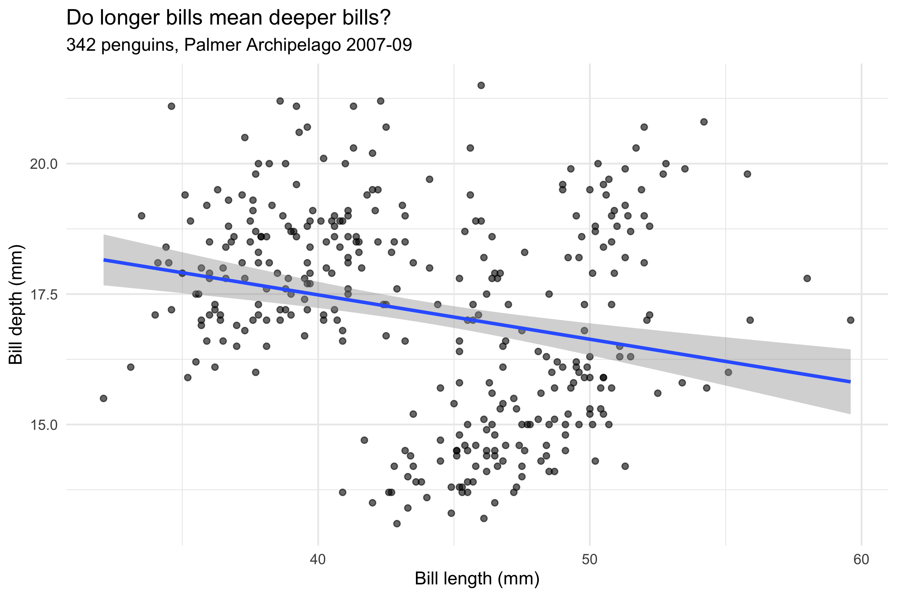
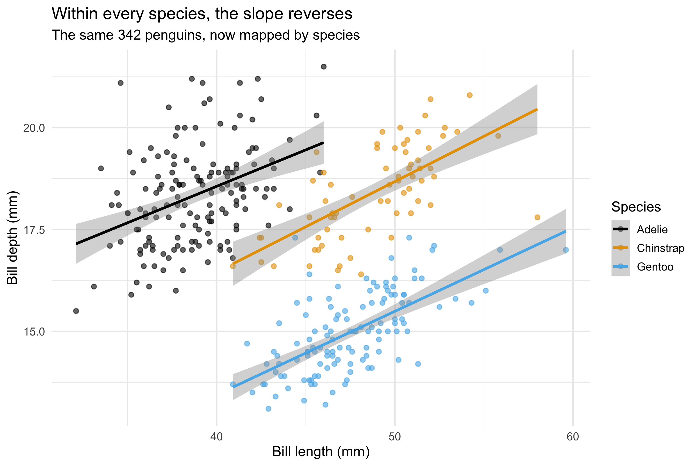

## The claim

- The **grammar of graphics** is a *design specification language*, not an R package
- **Agentic AI** can take over the language-specific implementation
- That leaves the analyst's attention on the **design decisions**: mappings, geoms, scales, facets, coords
- Today: test that claim live, on a TidyTuesday dataset **you** choose

. . .

And then: tell me where it breaks.

::: {.notes}
Plan for the hour: ~10 min concepts, 30+ min live, ~10 min summing up and critique.
They asked for critical feedback: say so up front and mean it. No product pitch.
This is the abstract in four lines. Everything else is either evidence or the demo.
:::

## The grammar travels

| Implementation | Language | A grammar? |
|---|---|---|
| ggplot2 | R | Yes — Wickham's layered grammar |
| plotnine | Python | Yes — near line-for-line port |
| Vega-Lite | JSON / JS | Yes — `mark` / `encoding` / `layer` |
| plotly | JS / Python / R | Layered, but not a true grammar |

The spec is **substrate-invariant**: the same mapping rules compile to any row marked "Yes".

::: {.notes}
Wilkinson 2005 is the origin; Wickham 2010 the working version. plotly is honestly
described as layered — figure objects with traces — rather than composable
grammar components. Happy to be corrected by this room on that.
:::

## Chatbot vs agent

::: {.columns}
::: {.column width="50%"}
**Chatbot**

- Sees only what you paste in
- Writes text for you to copy
- Forgets between sessions
:::
::: {.column width="50%"}
**Agent** (LLM in a code scaffold)

- Sits *in* the project folder
- Reads, writes and runs files: R, shell, git
- Renders the figure — and looks at it
- Follows written project instructions
:::
:::

::: {.notes}
Examples of scaffolds: Claude Code, OpenAI Codex, GitHub Copilot's agent mode — broadly
interchangeable for this purpose; the repo is set up to work with any of them.
The chat window is I/O, not the product.
:::

## Access — the supported route

- Frontier models in code scaffolds: e.g. **Claude Code** or **Codex** — interchangeable here; the repo works with either, or both
- At the University: **ELM**, the University's own AI gateway, is the institutionally supported route
- Nothing today depends on a particular vendor — the instructions and skills are plain text

::: {.notes}
No endorsement of either tool. I'm naming two only as examples,
together. Point people at ELM for anything they want to try with University data.
:::

## One instruction file, plain-text skills

```
agentic-datavis-workshops/
├── AGENTS.md            ← single source of truth for any agent
├── CLAUDE.md            ← one line: @AGENTS.md
├── .claude/skills/
│   ├── tt-fetch/        ← fetch + describe a TidyTuesday week
│   └── gg-spec/         ← YAML spec → ggplot2 → render → look
└── .agents/skills/      ← symlinks, so Codex sees the same skills
```

- A **skill** is a markdown procedure — readable by you, followed by the agent
- Skills exist for **consistent behaviour** across sessions and across vendors

::: {.notes}
Demystifying point: there's no magic config. AGENTS.md is the cross-vendor convention;
CLAUDE.md just imports it. Skills are checklists in markdown. Open one on screen if
anyone wants to see it.
:::

## The spec: round 1

::: {.columns}
::: {.column width="45%"}
```yaml
data: penguins
filter: "!is.na(bill_depth_mm)"
mapping:
  x: bill_length_mm
  y: bill_depth_mm
layers:
  - geom: point
    alpha: 0.6
  - geom: smooth
    stat: lm
    se: true
labs:
  title: "Do longer bills mean
          deeper bills?"
theme: minimal
```
:::
::: {.column width="55%"}

:::
:::

Pooled: longer bills, *shallower* bills?

::: {.notes}
Spec lightly trimmed for the slide (subtitle and axis labels omitted); full version is
specs/penguins-example.yml. Ask the room: what's wrong with this picture? The point
cloud is visibly clumpy — the spec hasn't distinguished the clumps.
:::

## The spec: round 2 — one line added

::: {.columns}
::: {.column width="45%"}
```yaml
mapping:
  x: bill_length_mm
  y: bill_depth_mm
  colour: species      # ← new
layers:
  - geom: point
    alpha: 0.6
  - geom: smooth
    stat: lm
    se: true
scales:
  colour: okabe-ito    # ← new
```
:::
::: {.column width="55%"}

:::
:::

**Simpson's paradox**: within every species the slope is positive.

::: {.notes}
One mapping line reverses the conclusion. Because geom_smooth inherits the plot-level
mapping, colour doesn't just tint the points — it groups the stat. Mappings feed
stats, not just ink. The spec trail is the record of the decision; nobody typed
ggplot2. Full spec: specs/penguins-example-2.yml. Worked page: example-gg-spec.qmd.
:::

## Taste the cake, change the recipe

- **Recipe** = the spec, the `.qmd`, the code. **Cake** = the rendered figure
- Look at the cake; edit the recipe; re-bake
- Hand-editing the output (Illustrator tweaks, pasted PNGs) = **frankencake**: unreproducible, untraceable
- **Git** is the safety net: every spec revision is committed, diffable, reversible

::: {.notes}
Version control is what makes it safe to let an agent edit files at speed. The numbered
spec files are the audit trail of design decisions.
:::

## Complementary strengths

| | People in the room | The agent |
|---|---|---|
| **Design judgement** | Meaning, audience, purpose | Knows the conventions, not the point |
| **Implementation** | Slow, syntax-bound | Fast, multi-language |
| **Looking** | Gestalt, "that's wrong" | Detail: clipped titles, overplotting |
| **Iteration** | Purposeful | Tireless, needs direction |

::: {.notes}
The division of labour today: you decide, it implements, we both look.
:::

## A spectrum of autonomy {.smaller}

::: {.columns}
::: {.column width="50%"}
**Far end: fully autonomous**

- The model chose datasets, questions, figures and words, unsteered
- Loop: **make → look → revise**
- Caught by looking: a title saying "fourfold" over bars showing tenfold; a density estimate collapsed on heaped data

<https://jonminton.github.io/claude-fable-vision-ds-test/>
:::
::: {.column width="50%"}
**Today: the other end**

- The room makes **every** design decision
- The agent types, renders, and reports what it sees
- Autonomous mode is a contrast, not the default
:::
:::

::: {.notes}
The autonomous project is an earlier experiment of mine: same toolchain, the agent was
its own reviewer. Other catches it logged: a subtitle colliding with a legend, and prose
numbers (365 vs 48) not matching its own chart (367 vs 30). Its own reflection: planning
finds the surprises you go looking for; conversation finds the ones you didn't.
If the room picks "How likely is 'likely'?", the autonomous page on the same data is a
ready-made comparison for the summing-up:
https://jonminton.github.io/claude-fable-vision-ds-test/probability-phrases.html
:::

## Live: you choose {.smaller}

Pre-cached (so bad wifi can't sink it) — or name **any other week**:

| Dataset | Week | Rows | Decisions it provokes |
|---|---|---|---|
| **Scottish Munros** | 2025-08-19 | 604 | Pivot first; map coords (`coord_fixed`) vs height |
| **UK Met Office stations** | 2025-10-21 | 39k | Month: discrete or cyclic? 37 stations: facet, filter, map |
| **How likely is 'likely'?** | 2026-03-10 | 98k | 19 phrases × probability: distribution geoms; axis order |

. . .

1. `tt-fetch`: fetch and describe the week's data
2. You dictate mappings → `gg-spec` compiles, renders, and we look
3. Revise the spec; repeat

::: {.notes}
Access: tidytues.day, github.com/rfordatascience/tidytuesday, or
tidytuesdayR::tt_load(). Vote by show of hands. Shortlist details, licences and
'what the data can't say' lines: sessions/2026-09-29/shortlist.md. Off-list week:
Rscript scripts/tt_fetch.R YYYY-MM-DD. Keep the numbered specs in
sessions/2026-09-29/specs/.
:::

## What to watch for — and critique

- **Visual judgement**: does the agent notice when a render is *wrong*, or only when it's *broken*?
- **Defaults as decisions**: every unspecified scale, palette, bin width and axis range is a choice someone made
- **Faithful compilation**: does the code do only what the spec says — or quietly "improve" it?
- **Provenance**: can you trace each figure back to a spec, a decision, and a commit?
- **Where the grammar runs out**: annotation, layout, interaction

::: {.notes}
This is the critical-feedback part they asked for. Vis researchers will have sharper
eyes on defaults and perception than on the tooling — invite that.
:::

## Summing up

- What worked? What did the agent get wrong, and who caught it?
- Is a YAML spec a useful *teaching* object for the grammar?
- What would you need to trust this in your own research?

**Repo (public, clone it):** <https://github.com/JonMinton/agentic-datavis-workshops>

**Read:** Wickham, [A Layered Grammar of Graphics](https://vita.had.co.nz/papers/layered-grammar.html) (2010) ·
[ggplot2 book](https://ggplot2-book.org) ·
[Vega-Lite docs](https://vega.github.io/vega-lite/docs/) ·
[plotnine](https://plotnine.org) · Wilkinson, *The Grammar of Graphics* (2005)

::: {.notes}
Thank them. Ask for critique by email too. If there's interest, follow-up workshops can
happen, and anyone can run one from the public repo. Make no promise of a schedule.
:::
